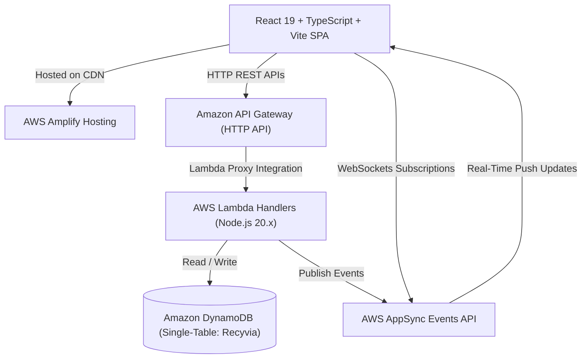

# RECYVIA

> **"REQUEST. COLLECT. RECOVER."**
>
> An on-demand recyclable waste collection platform connecting waste generators (households and commercial facilities), informal waste collectors, and recycling facilities with real-time job matching, digital scale recording, and downstream material recovery tracking.

---

## Product Overview & Operational Lifecycle

Recyvia coordinates doorstep recyclable waste collection through three connected user personas:

```
[ WASTE GENERATOR ] ---> [ INFORMAL COLLECTOR ] ---> [ RECYCLING FACILITY ] ---> [ RECOVERED ]
   Households /                 Doorstep Verification         Gate Intake &               Material
   Commercial Scraps            Scale Weight & OTP           Sorting Conversion          Processing
```

1. **REQUEST**: Waste generators (individual households or commercial facilities) submit pickup requests specifying waste categories (Paper, Plastics, Metals, E-Waste, Glass), estimated weights, preferred time slots, and settlement preferences (Cash or UPI).
2. **COLLECT**: Nearby informal collectors view available requests on a live radar, accept jobs, update transit status (`ON_THE_WAY`, `ARRIVED`), verify doorstep identity via a **6-Digit Security OTP**, record verified scale weights, and calculate final settlement amounts.
3. **RECOVER**: Completed pickups automatically flow to recycling facility queues as incoming materials (`AVAILABLE`), where facility operators log intake (`RECEIVED`), initiate sorting lines (`PROCESSING`), and confirm material conversion (`RECOVERED`).

---

## Cloud Architecture (AWS Serverless)



---

## Technology Stack

| Layer | Technologies | Description |
|---|---|---|
| **Frontend UI** | React 19, TypeScript, Vite, Tailwind CSS | Single Page Application with dark theme interface |
| **State & Storage** | React Context API, IndexedDB (Dexie.js) | Client-side state management with local persistence |
| **Real-Time Engine** | AWS AppSync Events | WebSockets pub/sub engine on `/pickups/*` channel |
| **API Layer** | Amazon API Gateway | HTTP API with CORS proxying to Lambda |
| **Compute** | AWS Lambda | Node.js 20.x TypeScript serverless route handlers |
| **Database** | Amazon DynamoDB | Single-table schema (`Recyvia` table) with On-Demand capacity |
| **Authentication** | 6-Digit OTP Service | Phone/email OTP entry with demo fallback (`123456`) |
| **Hosting** | AWS Amplify Hosting | Static web application hosting on global CDN |

---

## State Machine

### Pickup Request Lifecycle
```
[REQUESTED] ---> [MATCHING] ---> [ACCEPTED] ---> [ON_THE_WAY] ---> [ARRIVED]
                                                                        |
[COMPLETED] <--- [PAYMENT_PENDING] <--- [WEIGHT_VERIFICATION] <--- [OTP_VERIFICATION]
```

### Downstream Material Recovery Lifecycle
```
[AVAILABLE] ---> [RECEIVED] ---> [PROCESSING] ---> [RECOVERED]
```

---

## User Interface & Multi-Lingual Support

- **Dark Theme Interface**: Designed as a focused, dark-themed operations dashboard for waste collection logistics.
- **Multi-Lingual Landing Page**: Landing page provides regional language selection for English, Hindi, Tamil, Telugu, Kannada, and Bengali.

---

## Local Development & Testing

```bash
# 1. Clone the repository
git clone https://github.com/<your-username>/recyvia.git
cd recyvia

# 2. Install dependencies
npm install

# 3. Start local development server
npm run dev

# 4. Run automated test suite
npm test

# 5. Type-check & lint both frontend and backend
npm run lint

# 6. Production build verification
npm run build
```

---

## AWS Deployment Packaging

Pre-configured scripts to generate deployment bundles for AWS:

```bash
# Package frontend (creates recyvia-frontend.zip for AWS Amplify)
npm run package:frontend

# Package backend (creates backend/recyvia-backend.zip for AWS Lambda)
npm run package:backend

# Package both bundles
npm run package:all
```

---

## Documentation Index

- **[AWS Setup Guide](docs/AWS_SETUP.md)** — Step-by-step AWS console setup (Amplify, Lambda, DynamoDB, AppSync)
- **[AWS Architecture](docs/AWS_ARCHITECTURE.md)** — Cloud architecture, data flows, and security model
- **[Database Schema](docs/DATABASE.md)** — DynamoDB Single-Table layout, keys, and access patterns
- **[API Reference](docs/API.md)** — HTTP REST API endpoints, request schemas, and responses
- **[Real-Time Messaging](docs/REALTIME.md)** — AppSync Events WebSockets, event catalog, and channel structure
- **[Cost & Safety](docs/AWS_COST_CONTROL.md)** — AWS Free Tier resource limits and teardown commands
- **[Demo Walkthrough](docs/DEMO_GUIDE.md)** — Multi-persona demonstration script
- **[Scope & Roadmap](docs/LIMITATIONS.md)** — Current implementation scope and planned extensions
